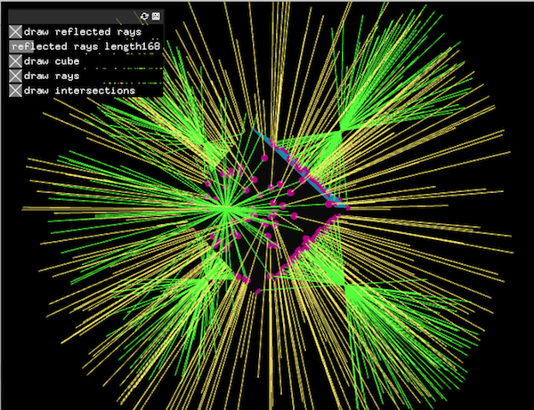
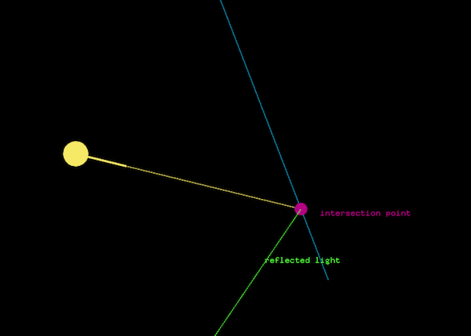
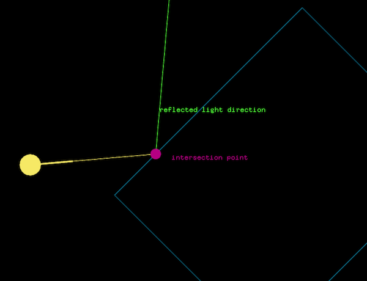
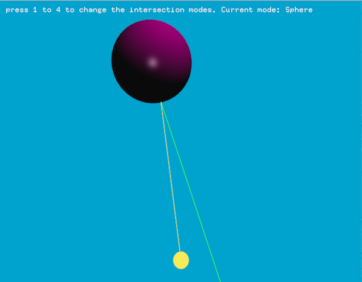

# ofxRaycaster

[](https://travis-ci.org/edap/ofxRaycaster)
[](https://ci.appveyor.com/project/edap/ofxraycaster)


This addon contains a definition of a ray in 2D and 3D dimension, and it includes methods to check for intersection with ofPrimitives, ofPolylines, segments, Plane etc ...

## How to use it:
Download this addon in your `addons` folder. Create a new project with the project generator and add as addon `ofxRaycaster`.
In your project, add at the top of your `ofApp.h` file

```cpp
#include "ofxRaycaster.h"
```
Now you are ready to use rays. To get started using a 2D ray in your project, declare a `ray` variable in your `ofApp.h` header file:

```cpp
ofxraycaster::Ray2D ray;
```

If you want to get your hands dirty with 3D rays, use instead of a 2D ray, a 3D one.
```cpp
ofxraycaster::Ray ray;
```

## Generic methods, for both 2D and 3D rays:

#### setup

```cpp
void setup(T _origin, T _direction)
```
it sets the origin and direction of a ray. For example, for a 2D ray:

```
ray.setup(glm::vec2(10,5), glm::vec2(1,0));
```

#### getOrigin

```cpp
glm::vec2 getOrigin();
```
It returns the origin of the vector. For example, for the 2D ray previously greated:
```cpp
ray.getOrigin(); // returns glm::vec2(10,5)
```

#### getDirection

```cpp
glm::vec2 getDirection();
```
It returns the direction of the vector. For example, for the 2D ray previously greated:
```cpp
ray.getDirection(); // returns glm::vec2(1,0)
```

#### setOrigin

```cpp
void setOrigin(glm::vec2 _origin);
```

It sets the origin of the ray;

#### setDirection

```cpp
void setDirection(glm::vec2 _origin);
```

It sets the direction of the ray;

#### draw

```cpp
void draw(float radius = 20.);
```

It draws a red circle indicating the position and a blue line indicating the direction, useful when debugging. It accepts a parameter to scale the dimension of the line representing the direction.


        

## 2D intersection methods:

#### intersectsPolyline
See example `example-polyline-intersection`

```cpp
bool intersectsPolyline(const ofPolyline & poly, float & distance, glm::vec2& surfaceNormal);
```

It checks for the intersection between a ray and an `ofPolyline`. If there is an intersection, it stores in `distance` and `surfaceNormal` respectively the distance from the origin to the intersection point, and a 2D normal of the segment of the polyline hit by the ray.

```cpp
ofxraycaster::Ray2D ray;
ofPolyline poly;

glm::vec2 surfaceNormal; // store the intersection value
float distance; // store the intersection value

if (ray.intersectsPolyline(poly, distance, surfaceNormal)) {
    glm::vec2 intersection = ray.getOrigin() + ray.getDirection() * distance;
    ofDrawLine(ray.getOrigin(), intersection);
}
```

#### intersectsSegment
See example `example-segment-intersection`

```cpp
bool intersectsSegment(const glm::vec2 & a, const glm::vec2 & b, float & distance)
```

It checks for the intersection between a ray and a segment. If there is an intersection, it stores in the variable `distance` the distance from the origin to the intersection point.


```cpp
ofxraycaster::Ray2D ray;
auto a = glm::vec2(10, 30);
auto b = glm::vec2(50, 50);
// the segment goes from point a to point b

float distance; // store the intersection value

if (ray.intersectsSegment(a, b, distance)) {
    glm::vec2 intersection = ray.getOrigin() + ray.getDirection() * distance;
    ofDrawLine(ray.getOrigin(), intersection);
}
```

## 3D intersection methods:

See `example-3D`

#### intersectsTriangle

It checks for the intersection between a ray and a triangle.

```cpp
bool intersectsTriangle(glm::vec3 const & vert0, glm::vec3 const & vert1, glm::vec3 const & vert2, glm::vec3 & baryPosition)
```


#### intersectsSphere

It checks for the intersection between a ray and a sphere.

```cpp
bool intersectsSphere(const glm::vec3 & _center, const float & _radius, glm::vec3& _position, glm::vec3 & _normal)
```

#### intersectsPrimitive

It checks for the intersection between a ray and an `ofPrimitive`.

```cpp
bool intersectsPrimitive(const of3dPrimitive& primitive,  glm::vec3 & baricentricCoords, glm::vec3 & intNormal)
```

#### intersectsPlane

It checks for the intersection between a ray and an `ofxraycaster::Plane`.

```cpp
bool intersectsPlane(ofxraycaster::Plane plane, float & distance);
```

#### intersectsMesh

Check the intersection between a ray and a mesh. See `example-mesh-intersection`.


```
bool intersectsMesh(const ofMesh& mesh,  glm::vec3 & baricentricCoords, glm::vec3 & intNormal);
```

Example:

```cpp
void ofApp::draw(){
    cam.begin();
    mesh.draw();
    ray.draw();

    glm::vec3 baricentricCoordinates; // it will store the barycentric coordinate of the triangle hit by the ray
    glm::vec3 surfaceNormal; // it will store the normal of the surface hit by the ray, if any.
    bool intersects = ray.intersectsMesh(mesh, baricentricCoordinates, surfaceNormal);
    
    // is there an intersection between the mesh and the ray?
    if (intersects) {
        auto intersection =
            ray.getOrigin() + ray.getDirection() * baricentricCoordinates.z;
        // draw the ray hitting the mesh
        ofDrawLine(ray.getOrigin(), intersection);
        // draw the intersection point
        ofDrawSphere(intersection, 5);

        // draw the reflected light
        auto reflLight = glm::reflect(ray.getDirection(), surfaceNormal);
        ofDrawLine(intersection, intersection + 100 * reflLight);
    }
    cam.end();
}
```

When a `glm::mat4` containing the transformation matrix of the mesh is given as second argument, it takes the transformation into account. See `example-mesh-intersection`

```
bool intersectsMesh(const ofMesh& mesh, const glm::mat4& transformationMatrix,  glm::vec3 & baricentricCoords, glm::vec3 & intNormal);
```

## Screenshots from examples

*multiple rays*



*segment intersection*



*polyline intersection*



*3D intersections with plane, triangle and 3D primitives*



                            
